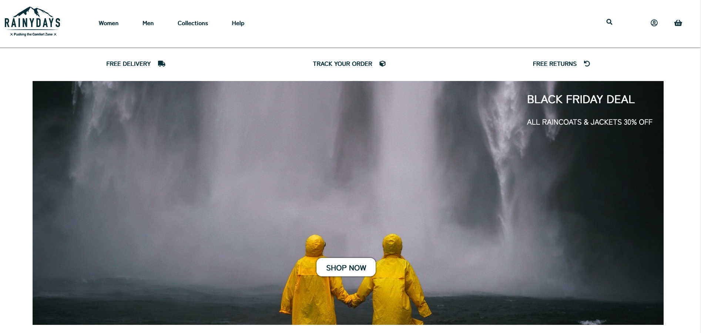

# cross-course-project-Kinga89

cross-course-project-Kinga89 created by GitHub Classroom

Rainy Days e-commerce website

**Description**
This is an e-commerce site for an online shop selling men's and women’s rain jackets. 
It was created for a course assignment with given logo. All other resources, like images have been found through free online photo databases.

Site architecture: 
- Home 
- List of Jackets 
- Specific page showing the jacket 
- About 
- Contact

**Built With** 
- HTML5 
- CSS 
- Javascript 
- WordPress REST API

**Installing**
Project can be accessed by cloning following repository: Noroff-FEU-Assignments/cross-course-project-Kinga89 

---

  

  

