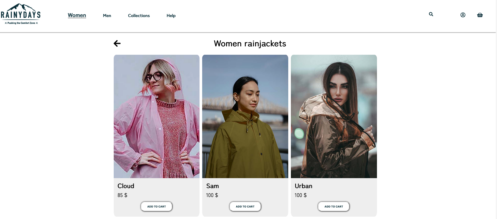

<h1>Rainy Days e-commerce site</h1>

<div id="images">


</div>

<h2>Description</h2>
<p>This is an e-commerce site for an online shop selling men's and women’s rain jackets. 
List of jackets is created with the help of Wordpress
It was created for a course assignment with given logo. All other resources, like images have been found through free online photo databases.
Contact form includes input validation that checks if the pattern matches with defined regular expression.</p>

<h3>Site architecture</h3>
<ul>
<li>Home</li>
<li>List of Jackets </li>
<li>Specific page showing the jacket</li>
<li>About</li>
<li>Contact</li>
</ul>


<h2>Built With</h2> 
<ul>
<li>HTML5</li>
<li>CSS</li>
<li>Javascript</li>
<li>WordPress REST API</li>
</ul>


<h2>Installing</h2> 
Project can be accessed by cloning following repository: 


```
git clone Noroff-FEU-Assignments/cross-course-project-Kinga89
```

---

<div id="social" align="center">
<a href="https://www.linkedin.com/in/kinga-kot-3a4b8a149/">
  
 </a>
  <a href="kotkiga89@gmail.com">
  
 </a>
</div>


<div align="center">
  
</div>
